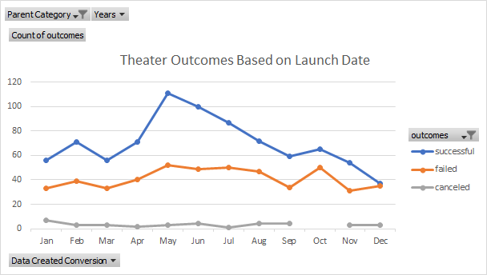
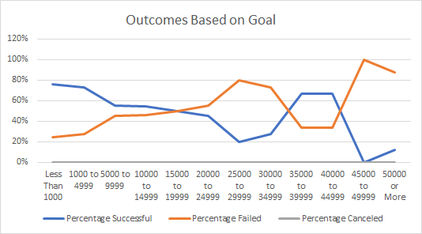

# Cogent Crowdfunding 

## Overview of Project

### Purpose
Using data obtained from crowdfunding platform, Kickstarter, I will be looking at both launch dates and funding goals to see the bigger picture of how they can relate to campaign outcomes specifically for the category, Theater.  
 
## Analysis and Challenges
### Analysis of Outcomes Based on Launch Date
Beginning with reviewing launch dates, I created a pivot chart that assisted me in organizing and visualizing Theater campaign outcomes in relation to the month of the year they were launched.  This table includes: 
- Filtered Kickstarter data to only include data from the parent Theater category 
- Data of Successful, Failed, and Canceled campaigns 
-January through December totals for each of the above mentioned outcomes.
While the numbers obtained through this pivot table is organized and easier to read without having to dig through all the Kickstarter data given, I created a graph with the data. This graph further supports the pivot table and allowed me to compare the three different outcomes and find trends in the data.  
Below, you can see that while the successful campaigns and the failed campaigns do have some space between them, they still seem to follow a similar trend of dips and peaks for the beginning half of the year.  The chart and the graph make it known that the months of May, June, and July have upticks in the total amount, which shows in both the successful and failed outcome lines. 

### Analysis of Outcomes Based on Goals
For outcomes based on their goals in the theater category, I needed to create a new chart that would organize the large amount of data.  The new chart created included:
- 12 goal ranges starting with goals less than or equal to 1000 all the way up to 50000 or greater. 
- The amount of each outcome (successful, failed, canceled) and the total for each goal range
- The percentage of these outcomes by goal range

This data was useful in acknowledging that most campaigns had goals under $15,000. Majority of them being in the $5000 or below range for both successful and failed outcomes. 

I created another line graph with this data to help visualize any trends. I also wanted to note that the lines representing successful and failed outcomes seem to horizontally reflect each other.  The larger the goal amount gets, the less campaigns exist so the data gets extreme to one side of the other for these ranges. 

### Challenges and Difficulties Encountered
The analyzing of launch dates to outcome wasn’t too difficult to create and graph. I did have some issues when creating the chart for the goal data including missing a line of range (45,000-49,000) that I didn’t realize was missing until I attempted to do the chart. The other difficulty I encountered was when calculating the percentages, I attempted to use the formula =ROUND(amount/total*100,0) but when I would change the cells to a percentage format they would be too large 760% instead of 76% for example. I determined that I needed to use the simpler formula of just =amount/total and then set the row from general to percentages. 

## Results
One conclusion that I came to when analyzing outcomes based on launch dates, is that May, June, and July have the highest total campaigns. On the opposite end the winter months of November and December have less campaigns in total. I imagine it is easier to raise funds when it isn’t near bigger holidays where families are spending money on buying gifts or traveling, so summer would appear to be a good time to run a campaign. 

The other conclusion I came to regarding Outcome to Launch Date is that while there are more successful campaigns in the summer – that doesn’t necessarily mean that they will do better considering this is also a peak for failed outcomes. This peak is due to the total amount of campaigns being higher. So, while it might be good to run in the summer, I feel like looking at further data might give a better idea on which month has a higher percentage of success than failure. 
While reviewing the data and graph for outcomes based on goals, I was able to conclude that the lower the amount of the goal, the greater chance there is for the campaign to succeed.  The higher the amount of your goal, the more likely you are to have a campaign fail. 

The limitation of this dataset was that this inquiry was very general. While I can make predictions based on this data, there could be other outlying factors that might be altering the data that isn’t included. General questions receive general answers. For example, filtering by the location, or including more information that might help to understand the data such as the number of backers per goal.  

For the Outcomes Based on Goal, I felt that the line chart wasn’t the best graph to use when handling percentages. A pie chart would have been more effective for visualizing successful vs failed outcomes per range category or even as a total view of all campaigns. Also, I feel like canceled outcomes could have been removed, it felt like a lot of white space with no values.  When reviewing the Outcomes Based on Launch Date, I feel like further filtering down the data might have been helpful. Perhaps by filtering the data to less years would give a better idea of what to expect now.  Some of the earlier years had very little to no data so they might be helping to tip the data in certain areas which could alter the conclusions made.   
