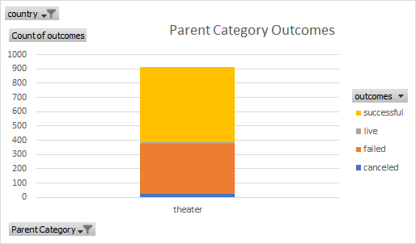

# Kickstarter Campaigns Analysis for Potential Play  

## Purpose

Louise, an upcoming playwriter wants to use crowdfunding to fund her upcoming play “Fever” with a budget set between $10,000 - $12,000 dollars. Through analysis of the data obtained from the crowdfunding platform, Kickstarter, I will assist her in finding patterns and factors that possibly contributed to successful campaigns that met their budget, as well as analyze failed campaigns to prevent mistakes from being replicated. With my findings and analysis, Louise can make educated choices when setting up her campaign to fund her play.

## First Glance

To begin to assist you setting up your campaign and expectations, I wanted to see how successful others like you may have been in their mission to fund a play. By filtering the categories to only show Theater and Plays historical data from Kickstarter, I was able to get a sample of the outcomes of former, canceled, live, and current campaigns. By using conditional formatting and continuing to filter out unnecessary data, I have made it easier to visualize that crowdfunding in the US for Theater and Plays in column outcomes using color coding. This first glance lets me know that there have been more successful campaigns than failures.

To further illustrate this, I created a graph (below) using a pivot table that shows out of 912 campaigns for Theater, about 60% were successful and about 35% failed. This same is apparent in the Subcategory statistics and graph for plays out of 1066 campaigns, around 60% succeeded in reaching their goal while about 30% failed.  It seems safe to say that funding a play has a higher probability of succeeding than failing based on this data.

## Timing

Another element Louise will need to keep in mind is the timing of her campaign. I converted the dates to be understandable and then used another pivot chart to illustrate the data for outcomes based on the campaigns launch date. By looking at the line graph with markers, you can see that the highest amount of successful theater campaigns for the US happened in May and June. May’s successful campaigns accounted for 60% of all the campaigns that month versus the 32% of failed campaigns. This helps us to estimate that May would be an ideal time to begin a campaign.

## A Deeper Look

While knowing when to start the campaign and knowing that the type of campaign has a greater potential for success than failure, I wanted to include a deeper analysis of the spread of the data. This can be useful in setting up your goal and pledge amounts. The statistics that help paint the picture of data distribution can be found in the Descriptive Statistics tab. 

 I was able to use the average formula to get the mean for the goal amounts. By comparing successful and failed campaigns, failed campaigns averaged a higher goal (10,554) than those who succeeded (5,049). Looking at the Pledges, the average pledge amount is larger than the goal amount for successful campaigns. For Failed, the average goal amount is almost 20 times higher than the average pledge received. So far we can already see that setting higher goals might be detrimental to a campaign.

While that is helpful, to further evaluate the spread of the data I needed to find the quartiles, standard deviation, and Interquartile range (IQR). Calculating the standard deviation, which is higher than the average, helps me to determine that amounts below the average mount are closer to the median.  

We can also us that information along with the IQR to know that the successful campaigns IQR of pledged amount was higher than the IQR of the Goal, whereas for the failed campaigns, the IQR of goal amount was almost 20 times higher than the IQR of the pledged amount.  

## Review

Based on the data I have worked through; it seems that success is tangible but there will need to be some tweaking to your setup. I would recommend that you begin your campaign in May. When evaluating the goal and pledge amount, I concluded that higher campaigns have a higher chance of failing.  Considering your goal is in the upper 10,000 – it might be risky to go with that amount for your first campaign. It also appears that successful campaigns received higher pledge amounts, which is possibly how they met their goal or even go beyond. So, finding potential larger donators, setting your goal to 6k at max might be the best way for you to get funded. There are plenty of campaigns who went over their goal amount, so there is also still a chance for you to make it closer to the 10k you originally estimated.
